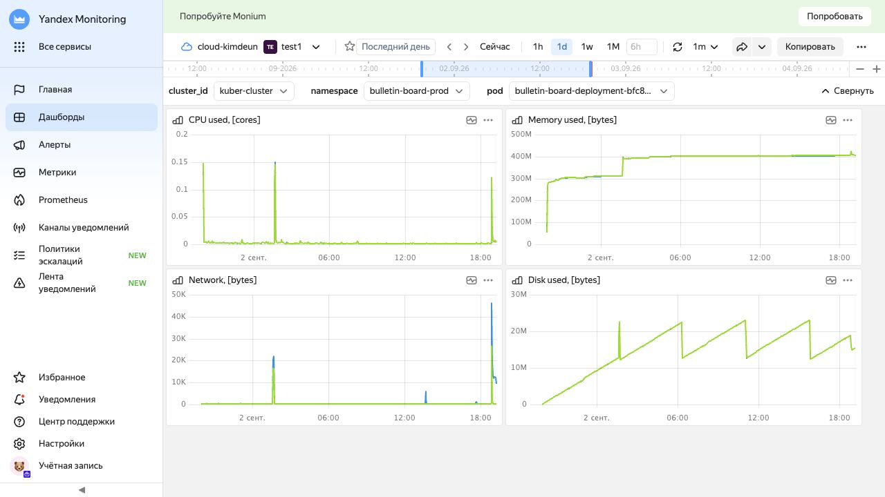
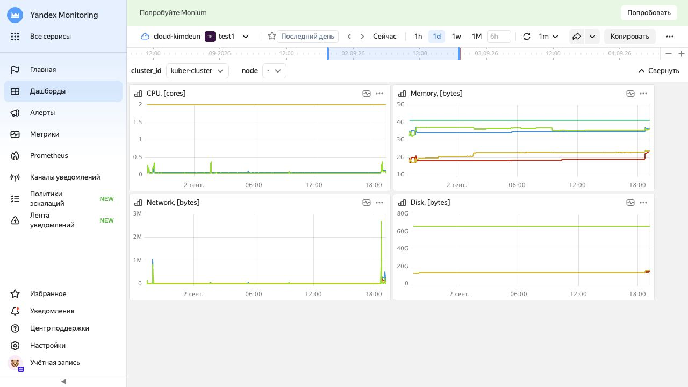

# Наблюдаемость Bulletin Board

## Архитектура

```text
Spring Boot /actuator/prometheus
  -> Service bulletin-board-metrics:9090
  -> ServiceMonitor
  -> Prometheus Operator
  -> Yandex Managed Service for Prometheus

stdout/stderr контейнеров
  -> Fluent Bit на каждой рабочей ноде
  -> Yandex Cloud Logging
```

## Метрики

- Prometheus workspace: `monmshuesmqbf1t0aft7`.
- Интервал сбора метрик приложения: 30 секунд.
- Endpoint: `/actuator/prometheus`.
- Оба pod приложения отображаются в Prometheus как targets со статусом `up`.

Основные PromQL-запросы:

```promql
# Запросы в секунду
sum(rate(http_server_requests_seconds_count{job="bulletin-board-metrics"}[5m]))

# Средняя latency, секунды
sum(rate(http_server_requests_seconds_sum{job="bulletin-board-metrics"}[5m]))
/
clamp_min(sum(rate(http_server_requests_seconds_count{job="bulletin-board-metrics"}[5m])), 0.000001)

# Количество 5xx за пять минут
sum(increase(http_server_requests_seconds_count{job="bulletin-board-metrics",status=~"5.."}[5m]))

# Рестарты приложения за десять минут
sum(increase(kube_pod_container_status_restarts_total{namespace="bulletin-board-prod",pod=~"bulletin-board-deployment-.*"}[10m]))
```

## Централизованные логи

- Cloud Logging group: `e233sa8sboiqaot7rl6i`.
- Имя: `bulletin-board-prod`.
- Retention: 168 часов / 7 дней.
- Fluent Bit работает как DaemonSet: по одному pod на каждой рабочей ноде.
- Resource type записи соответствует namespace.
- Resource ID соответствует имени pod.

Фильтрация логов приложения:

```bash
yc logging read e233sa8sboiqaot7rl6i \
  --since '15m ago' \
  --resource-types bulletin-board-prod \
  --limit 20
```

Дополнительно можно фильтровать по уровню:

```bash
yc logging read e233sa8sboiqaot7rl6i \
  --since '1h ago' \
  --resource-types bulletin-board-prod \
  --levels ERROR
```

## Dashboard

Grafana dashboard `Bulletin Board Observability` хранится как ConfigMap и автоматически загружается sidecar-контейнером Grafana. Панели:

1. Request rate.
2. Average HTTP latency.
3. HTTP 5xx responses.
4. Pod restarts.
5. Application CPU.
6. Application memory.

Локальный доступ к Grafana:

```bash
kubectl port-forward \
  -n prometheus-operator-space \
  service/prometheus-grafana \
  3000:80
```

## Алерты

Ресурс `PrometheusRule/bulletin-board-alerts` содержит:

- `BulletinBoardTargetDown`: target недоступен более двух минут;
- `BulletinBoard5xxErrors`: за пять минут появился хотя бы один 5xx;
- `BulletinBoardHighLatency`: средняя latency выше 500 мс в течение пяти минут;
- `BulletinBoardPodRestarts`: за десять минут был рестарт контейнера.

Все четыре правила загружены Prometheus и имеют `health=ok`.

## Скриншоты

### Метрики pod приложения



### Метрики рабочих нод



## Файлы конфигурации

- `terraform/k8s/iam.tf`: сервисные аккаунты и IAM-роли.
- `terraform/k8s/logging.tf`: Cloud Logging group и retention.
- `terraform/k8s/outputs.tf`: ID группы и сервисного аккаунта Fluent Bit.
- `k8s/monitoring.yaml`: metrics Service и ServiceMonitor.
- `k8s/observability-dashboard.yaml`: Grafana dashboard-as-code.
- `k8s/alerts.yaml`: Prometheus alert rules.

Файлы `secret.prometheus-api-key.json` и `secret.fluent-bit-key.json` содержат закрытые ключи, имеют права `600` и исключены из Git правилом `secret*`.
